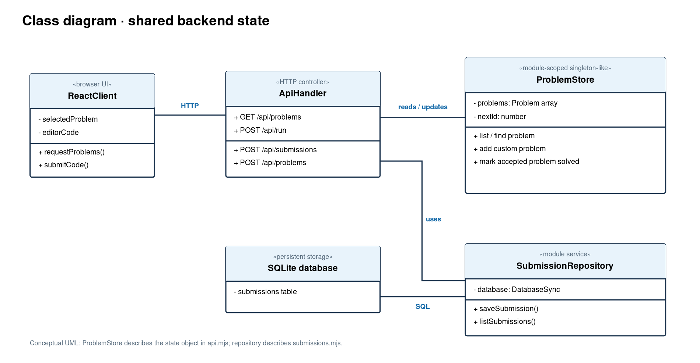
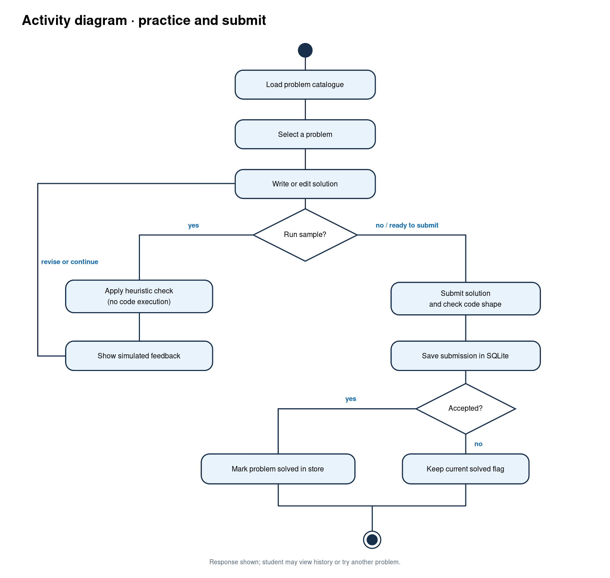
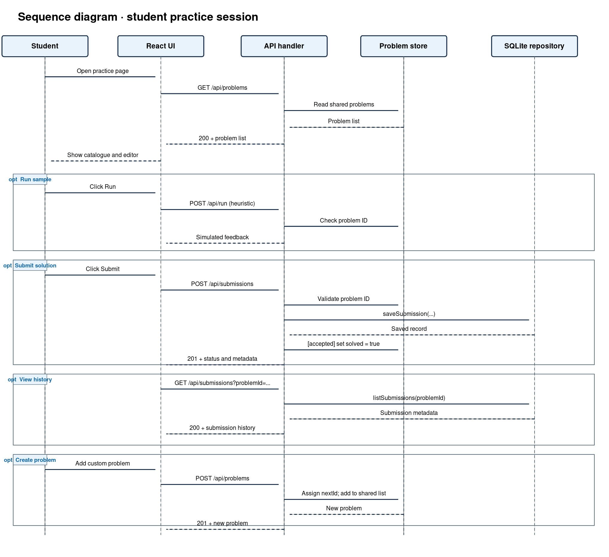

# Student Interview Preparation System — Project Review

## Abstract

The Student Interview Preparation System is a browser-based coding practice application built with React, Vite, and a Node.js API. Students can browse interview-style problems, filter them by difficulty, draft solutions, request a simulated sample check, submit code, review submission history, and add custom problems. The backend keeps its problem catalogue and next problem ID in one module-scoped object shared by requests handled within the same Node.js process. That shared object is the project's Singleton-like element: it gives API routes a consistent view of the current catalogue without repeatedly constructing a store. Submission records are handled separately through SQLite, so they can persist across restarts when the database file is retained. The current checking logic uses a code-shape heuristic; it does not execute submitted programs or verify algorithmic correctness.

## Scope

This review covers the React practice workflow, Node API, module-scoped problem store, SQLite submission storage, and the Singleton design boundary within one running server process.

## Project description

The checked-in application is named **Codegrid** in its interface and package metadata. This report uses the requested academic title, **Student Interview Preparation System**, for that application. Its main features are a problem catalogue, difficulty and text filters, a code editor, simulated checks, submissions, submission history, solved indicators, and custom problem creation. React renders the interface; `api.mjs` handles the HTTP API; `server.mjs` serves the production build; and `submissions.mjs` manages SQLite records.

## Why this uses the Singleton pattern

The production server and development middleware import the same `api.mjs` module within their respective Node.js processes. That module creates one `state` object containing `problems` and `nextId`. Reads, custom problem creation, and solved-status updates all use that object. A single shared store suits this small demonstration because it avoids conflicting per-request catalogues and keeps the route code simple. JavaScript module caching supplies the single instance; the project does not implement a formal Singleton class or global application-wide Singleton. Another server process would have its own `state` object.

## Singleton template

This **illustrative** JavaScript template shows the conventional form. It is a teaching example, not a file in the application:

```js
class ProblemStore {
  static #instance;

  constructor() {
    if (ProblemStore.#instance) return ProblemStore.#instance;
    this.problems = [];
    this.nextId = 1;
    ProblemStore.#instance = this;
  }

  static getInstance() {
    return ProblemStore.#instance ?? new ProblemStore();
  }

  addProblem(problem) {
    const saved = { ...problem, id: String(this.nextId++).padStart(3, '0') };
    this.problems.push(saved);
    return saved;
  }
}

const store = ProblemStore.getInstance();
```

The application uses the lighter **module-scoped equivalent**. This shortened excerpt reflects `api.mjs`:

```js
const state = {
  problems: structuredClone(seedProblems),
  nextId: 8
};

// GET /api/problems reads state.problems.
// POST /api/problems adds a problem and increments state.nextId.
// An accepted POST /api/submissions sets problem.solved = true.
```

## Diagrams

The class diagram is a **conceptual UML view**. `ProblemStore` represents the actual module-scoped `state` object; its listed operations describe API behavior, rather than methods literally declared on that object. `SubmissionRepository` represents the exported functions and shared database connection in `submissions.mjs`.

### Class diagram



### Activity diagram

The activity diagram follows one student's practice and submission path. The optional sample run does not store a submission; submitting does.



## Boundary of responsibility

| Component | Responsibility | Lifetime or storage |
|---|---|---|
| Module-scoped `state` in `api.mjs` | Hold problem definitions, new problem IDs, and current solved flags | One copy per Node.js process; custom problems reset on restart |
| `apiHandler` in `api.mjs` | Validate requests, select routes, apply the heuristic check, and send JSON responses | Called for each API request |
| `submissions.mjs` | Save submitted code, list submission metadata, and load accepted problem IDs | One module-level SQLite connection per process; records persist in the database file |
| React UI | Manage the student's current selection, editor text, filters, and displayed feedback | Browser component state |

The problem store does **not** own the SQLite submission records, run submitted code, authenticate students, or coordinate state across multiple server processes. On startup, accepted submissions from SQLite mark matching seeded problems as solved. Custom problem definitions are not restored from SQLite, even if submissions for them remain there.

## Pattern definition

The Singleton pattern provides a single accessible instance of a particular service or state holder within a defined scope. In this project, the scope is **one Node.js process**. Loading `api.mjs` creates the shared `state` object once, and subsequent requests through the imported handler access that same object. This is a module-scoped Singleton-like store rather than an explicit class with a private constructor.

## Mechanics of the pattern in this case

1. Node.js loads `api.mjs` when the production server or Vite development middleware imports `apiHandler`.
2. Module initialization clones the seed problems into `state` and reads accepted problem IDs from SQLite.
3. `GET /api/problems` reads the shared array; `POST /api/problems` adds a custom problem and advances `nextId`.
4. `POST /api/run` checks that the selected problem exists and applies `solutionLooksValid`. It returns simulated feedback without executing code or saving a submission.
5. `POST /api/submissions` validates the problem, applies the same heuristic, saves the record through `submissions.mjs`, and marks the in-memory problem solved if accepted.
6. Future requests in that process see the updated problem store. Restarting the process recreates the catalogue; retained SQLite submissions can restore solved flags for seeded problems.

## Complete flow of usage — sequence diagram

The sequence covers catalogue loading, an optional sample run, a submission, history retrieval, and optional custom problem creation. The `alt` and `opt` frames indicate conditional parts of a student's session.



### Review conclusion

The module-scoped problem store is an appropriate small-scale Singleton-like choice for a single-process demonstration. Its main limits are process-local custom problems and solved flags, heuristic-only code checking, and a shared submission database without student accounts. A larger deployment would need durable problem storage and a clear per-user data model.
